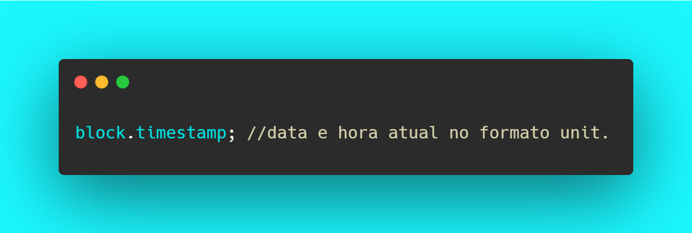

# 7. Variáveis built-in (msg.sender, msg.value...)

## block.chainid

A rede principal da Ethereum mainnet possui um id 1 e uma das redes de teste chamada Rinkeby possui id 3. Enquanto outras redes EVM como a Binance possui id 56, você pode ver uma lista completa de Chain IDs em [https://chainlist.org/](https://chainlist.org).

.png>)

## block.coinbase

Quando for feito o deploy do contrato que estiver sendo escrito, um minerador irá incluí-lo na blockchain e através desse parâmetro é possível interagir com esse minerador. Ou até mesmo depois quando for feita uma interação com esse contrato poderá acessar o minerador que processou essa interação.

.png>)

## block.difficulty

O parâmetro dificuldade é o que "regula" a emissão de novas moedas dentro de uma rede baseado na quantidade de mineradores que estão trabalhando nisso e esse parâmetro está sempre sendo ajustado de acordo com a oferta e demanda de poder computacional para realizar os testes de hash. Atráves de block.difficulty é possível acessar a dificuldade de mineração no bloco atual.

.png>)

## block.gaslimit

Quanto mais cálculos e operações um smart contract tiver, mais gas ele irá consumir. Usando esse parâmetro é possível acessar a quantidade de gas disponível no bloco atual para saber se seu contrato irá ser processado ou não.

.png>)

## block.number

Retorna o numero do bloco atual, pode ser usado pra muitas coisas e uma das mais comuns é travar dinheiro até determinado bloco.

No momento em que escrevo isso o bloco atual da rede Ethereum é [13525758](https://etherscan.io/block/13525758).

.png>)

## block.timestamp

Timestamp é um formato muito conhecido para _encodar_ data e hora em um formato númerico, por exemplo o timestamp de agora é: 1635696570.

## msg.sender

Deve-se ficar muito atento ao uso que será feito dessa instrução pois no caso de criação do contrato, msg.sender será o criador do contrato mas depois em uma interação com esse contrato msg.sender será a carteira ou outro contrato que interagiu com ele.

.png>)

## msg.value

Irá acessar a quantidade de Ethers (ou outra moeda se for outra blockchain) que foi enviada em uma transação.

.png>)

## tx.origin

Muito parecido com msg.sender porém refere-se somente a endereços de carteira enquanto msg.sender pode referir-se também a contratos. Para compreender o uso mais detalhado acesse [Broken link](broken-reference "mention").

.png>)

## tx.gasprice

Irá retornar o preço de gas da transação.

.png>)

